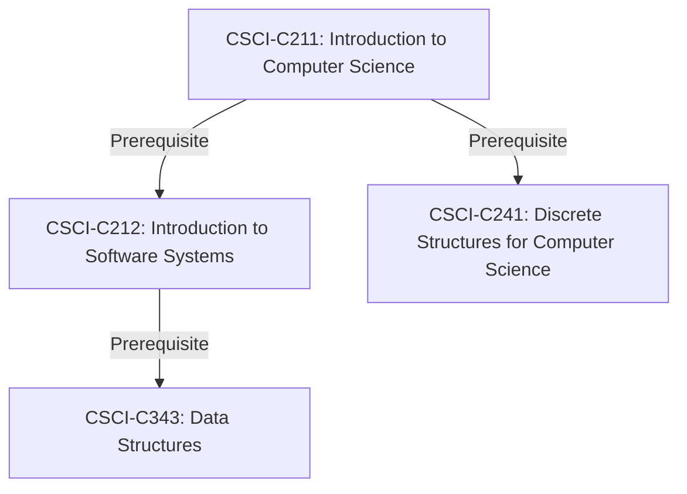

## Coursework 

This page contains the (relevant) coursework I have completed during my time in Indiana University. 

## Computer Science Bachelors... 

### Fall 2023

- CSCI-C211: Introduction to Computer Science 

### Spring 2024 

- [CSCI-C212: Introduction to Software Systems 
](https://joshuacrotts.us/teaching/c212-s24.html)
- CSCI-C241: Discrete Structures for Computer Science
- INFO-I101: Introduction to Informatics 

### Fall 2024

- CSCI-C343: Data Structures 
- CSCI-Y395: Career Development for CSCI Majors 

### Spring 2025 

- happens >:( 

### Fall 2025 (ongoing)

- CSCI-C291: System Programming with C and Unix 
- CSCI-B461: Database Concepts 

### Spring 2026 (TBD)

## Mathematics Minor... 

## Atmospheric Science Minor... 

### Fall 2024 

- [EAS-E144: Extreme Weather and Its Impacts
](https://iuearth.com/e144/) 
- EAS-A340: Physical Meteorology and Climatology 

### Spring 2025 

- PHYS-P221: PHYSICS 1 
- [EAS-A460: Mesoscale Meteorology
](https://iuearth.com/a460/) 

### Fall 2025 (ongoing)

 - [EAS-A339: Weather Analysis and Forecasting
](https://iuearth.com/a339/) 

